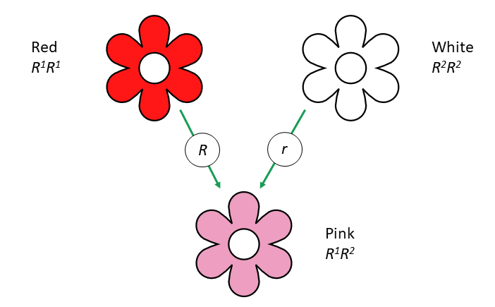
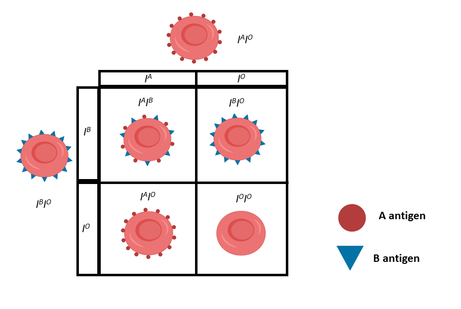

```{r setup, include=FALSE}
options(htmltools.dir.version = FALSE, echo = FALSE)
```

```{r xaringan-themer, include=FALSE, warning=FALSE}
library(xaringanthemer)
style_duo_accent(
  primary_color = "#01CC99",
  secondary_color = "#C3EBE2",
    link_color= "#245239",
  inverse_header_color = "#2E414D", 
  code_inline_color = "#179c55",
    code_font_family = "GlacialIndifferenceRegular",
  code_font_url = "https://fontlibrary.org/face/glacial-indifference",
  text_font_family = "GlacialIndifferenceRegular",
  text_font_size = "25px",
  text_font_url = "https://fontlibrary.org/face/glacial-indifference",
  header_font_family = "Sifonn",
  header_font_url = "https://fonts.cdnfonts.com/css/sifonn",
)

library(kableExtra)
library(tidyverse)
```


class: center, middle

This session will be recorded for you to playback at any time, 
all slides are publically available on my GitHub page:

[Philip-Leftwich/nonmendelian_inheritance](https://github.com/Philip-Leftwich/nonmendelian_inheritance).


All diagrams and images are accompanied with alt-text.


---

# Hello! 👋

Let's warm up! 

There are two ways to engage today:

--

.pull-left[
## Teams Chat

- Text box for questions


]

--

.pull-right[
## Slido

- Go to slido.com

- Enter participant code 
### 733 633


]


---

## Learning Outcomes


1.  You will be able to `understand` why some crosses `don't` conform to Mendelian Inheritance

--

2.  You will be able to `analyze` genetic crosses for incomplete dominance & co-dominance

--

3.  You will be able to `describe` gene interaction and `analyze` complex patterns of inheritance produced by epistasis

---


# Mendelian Inheritance

** a quick `recap`**

1. `Law of dominance`


---

# Mendelian Inheritance

** a quick `recap`**

1. `Law of dominance`

2. `Law of segregation` 


---

# Mendelian Inheritance

** a quick `recap`**

1. `Law of dominance`

2. `Law of segregation`

3. `Law of independent assortment` 

Genes of different traits sort independently. 


---

# A Dihybrid cross
** `peas` check out my Punnett square**

 

---

# A Dihybrid cross
** `peas` check out my Punnett square**


---

# A Dihybrid cross
** `peas` check out my Punnett square**


---

# A Dihybrid cross
** `peas` check out my Punnett square**


---

# A Dihybrid cross
** `peas` check out my Punnett square**


---


# A Dihybrid cross


```{r echo=FALSE, warning=FALSE}
knitr::kable(rbind(
              c("", "", "3/4 are round","(3/4)(3/4)=9/16 yellow, round" ),
              c("", "3/4 are yellow", "1/4 are wrinkled","(3/4)(1/4)=3/16 yellow, wrinkled"),
              c("","", "3/4 are round", "(1/4)(3/4)=3/16 green, round"),
              c("", "1/4 are yellow", "1/4 are wrinkled","(1/4)(1/4)=3/16 green, wrinkled")
),
col.names = c("F2", "Of all offspring", "Of all offspring" , "Combined probabilities"), align="lccc",
  booktabs = TRUE) %>% 
    kable_styling(bootstrap_options = c("striped", "hover", "condensed", "responsive")) %>% 
    add_header_above(c("F1 yellow, round x yellow, round" = 4)) %>% 
  column_spec(2, image = spec_image(
    c("images/arrow.png","images/blank.png" , "images/arrow.png","images/blank.png" ), 50, 50))
```

---

class: inverse, center, middle, 

## 🧬 Examples of `Non`-Mendelian Inheritance 🧬

.footnote[How do we interpret patterns of inheritance that seem to defy one or more of Mendel's Laws???]

---


## 1. `Partial` Dominance

Neither allele is dominant & heterozygotes have an `intermediate` phenotype.

 

---

## 1. `Partial` Dominance

Partial dominance means the `phenotype` ratio is the **same** as the `genotype` ratio 

 

---

## 2. `Co`dominance

Both alleles produce distinct, detectable gene products that are expressed `equally` in heterozygotes. 

```{r echo=FALSE, warning=FALSE}
library(kableExtra)
library(tidyverse)

knitr::kable(rbind(
              c("MM", "M"),
              c("MN", "MN"),
              c("NN", "N")
), format='html',
col.names = c("Genotype", "Phenotype"), align="lccc",
  booktabs = TRUE) %>% 
    kable_styling(bootstrap_options = c("striped", "hover", "condensed", "responsive")) %>% 
  add_header_above(c("The MN blood group" = 2)) 
```
---

## 2. `Co`dominance

Both alleles produce distinct, detectable gene products that are expressed `equally` in heterozygotes. 

```{r echo=FALSE, warning=FALSE}


knitr::kable(rbind(
              c("MN X MN"),
              c(""),
              c("1/4 MM"),
              c("1/2 MN"),
              c("1/4 NN")
),

  booktabs = TRUE, align='c') %>% 
    kable_styling(bootstrap_options = c("striped", "hover", "condensed", "responsive")) %>% 
  column_spec(1, image = spec_image(
    c("images/blank.png","images/arrow.png" , "images/blank.png","images/blank.png", "images/blank.png" ), 50, 50))

```
---

## 2. `Co`dominance

Both alleles produce distinct, detectable gene products that are expressed `equally` in heterozygotes. 




.footnote[*I* stands for isoagglutinogen, a `fancy` term for antigen]

---
class: middle, center, inverse

## ☁📊☁
# Question Time!

### [slido.com](slido.com)


### 733 633

---

## 3. Epistasis

`Gene interactions` - sometimes more than one gene is needed to produce a phenotype.


---
## 3. Epistasis

`Gene interactions` - sometimes more than one gene is needed to produce a phenotype.


---
## 3. Epistasis

`Gene interactions` - sometimes more than one gene is needed to produce a phenotype.


---
## 3. Epistasis

`Gene interactions` - sometimes more than one gene is needed to produce a phenotype.


---

## 3. Epistasis

The genotype of one gene `masks or modifies` the effect of another gene.


--

.footnote[Homozygotes for *fut1*<sup>h</sup> always have an O blood phenotype]

---
class: middle, center

## ☁📊☁
### Question Time! [slido.com](slido.com) # 733 633


---
class: center, middle

# Exit Tickets 🎫

Think 💭 Pair 🧑🏾‍🤝‍🧑🏼 Share 📣

.pull-left[
"Which part of the lesson lost you today?"

]

.pull-right[
"Which part of the lesson do you understand well?"

]


---
class: center, middle

# Reading 📖

Chapter 4. Extensions of Mendelian Genetics

Concepts of Genetics (10th or 11th  Edition); Klug W.S., Cummings M.R., Spencer C.A., Palladino M.A. 


---
class: center, middle

# Exercise 💪


Complete the quiz on Blackboard to test your knowledge 

Get 100% to earn your `Mendel Rules` Badge!!!


---

class: center, middle

# Thank you!


Web [https://philip-leftwich.github.io/](https://philip-leftwich.github.io/)


