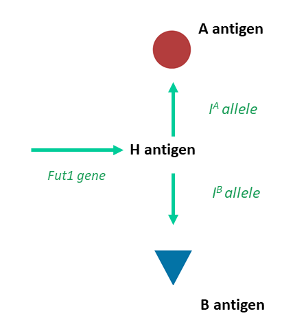
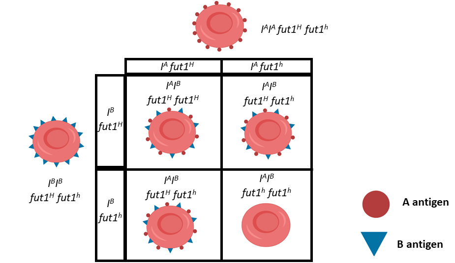

```{r setup, include=FALSE}
options(htmltools.dir.version = FALSE, echo = FALSE)
```

```{r xaringan-themer, include=FALSE, warning=FALSE}
library(xaringanthemer)
style_duo_accent(
  primary_color = "#01CC99",
  secondary_color = "#C3EBE2",
    link_color= "#245239",
  inverse_header_color = "#2E414D", 
  code_inline_color = "#179c55",
    code_font_family = "GlacialIndifferenceRegular",
  code_font_url = "https://fontlibrary.org/face/glacial-indifference",
  text_font_family = "GlacialIndifferenceRegular",
  text_font_size = "25px",
  text_font_url = "https://fontlibrary.org/face/glacial-indifference",
  header_font_family = "Sifonn",
  header_font_url = "https://fonts.cdnfonts.com/css/sifonn",
)

```


class: center, middle

This session will be recorded for you to playback at any time, 
all slides are available on my GitHub profile, 
diagrams and images are accompanied with alt-text


---

# Hello! 👋

Let's warm up! 

There are two ways to engage today:

--

.pull-left[
## Teams Chat

- Text box for questions


]

--

.pull-right[
## Slido

- Go to slido.com

- Enter participant code 
### 733 633


]


---

## Learning Outcomes


1.  You will be able to understand when crosses don't conform to Mendelian Inheritance

--

2.  You will be able to analyze monohybrid crosses for incomplete dominance & co-dominance

--

3.  You will be able to describe complex patterns of inheritance involving epistasis

---


# Mendelian Inheritance

** `a quick` recap**

1. `Law of dominance & uniformity`


---

# Mendelian Inheritance

** `a quick` recap**

1. `Law of dominance & uniformity`

2. `Law of segregation` 


---

# Mendelian Inheritance

** `a quick` recap**

1. `Law of dominance & uniformity`

2. `Law of segregation`

3. `Law of independent assortment` 

Genes of different traits sort independently. 


---
class: center

# A `Dihybrid` cross


---
class: center

# A `Dihybrid` cross


---
class: center

# A `Dihybrid` cross


---
class: center

# A `Dihybrid` cross


---
class: center

# A `Dihybrid` cross


---
class: inverse, center, middle, 

## 🧬 Examples of `Non`-Mendelian Inheritance 🧬

.footnote[How do we interpret patterns of inheritance that seem to defy our understanding of the 'rules' of inheritance???]

---


## 1. `Partial` Dominance

Something


---

## 2. `Co`dominance

Something


---
class: middle, center, inverse

## ☁📊☁
# Question Time!

### [slido.com](slido.com)

### 733 633

---

## 3. Epistasis

Sometimes more than one gene is needed to produce a phenotype



---

## 3. Epistasis



--

.footnote[Homozygotes for *Fut1*<sup>h</sup> always have an O blood phenotype]

---
class: middle, center, inverse

## ☁📊☁
# Question Time!

### [slido.com](slido.com)

### 733 633

---

# Exit Tickets 🎫

Think 💭 Pair 🧑🏾‍🤝‍🧑🏼 Share 📣

.pull-left[
"Which part of the lesson lost you today?"

]

.pull-right[
"Which part of the lesson do you understand well?"

]


---

# Reading 📖

Chapter 4. Extensions of Mendelian Genetics

Concepts of Genetics (10th or 11th  Edition); Klug W.S., Cummings M.R., Spencer C.A., Palladino M.A. 


---
class: center, middle

# Exercise 💪


Complete the quiz on Blackboard to test your knowledge 

Get 100% to earn your `Mendel's Rules` Badge!!!


---

class: center, middle

# Thank you!


Web [https://philip-leftwich.github.io/](https://philip-leftwich.github.io/)

---

# Mendelian Inheritance

** `a quick` recap**

1. `Law of dominance & uniformity`: some alleles are dominant, while others are recessive.

--

2. `Law of segregation`: Gametes only carry one allele for each gene. 

--
3. `Law of independent assortment`: Genes of different traits sort independently. 

.pull-right[


Mendel & his peas

]

---

# `Non`-Mendelian Inheritance

1. `Partial` Dominance

--

2. `Co`dominance

--

3. Epistasis

---

